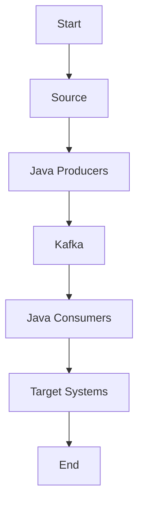
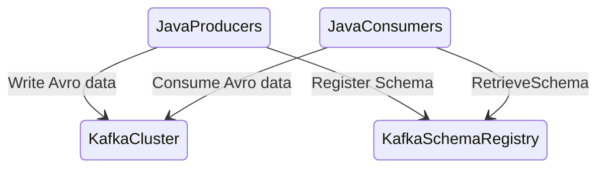
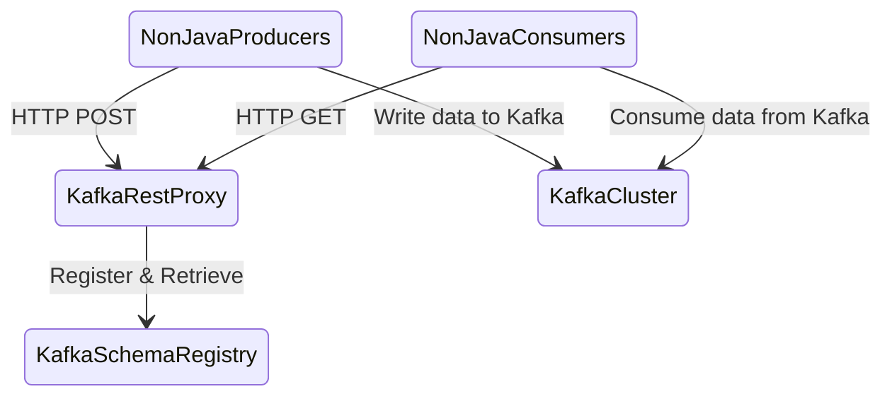

## Kafka Ecosystem: 

```mermaid
flowchart

    A[Start] --> B[Source]
    B --> C[Java Producers]
    C --> D[Kafka] 
    D --> E[Java Consumers] 
    E --> F[Target Systems]
    F --> G[End]
``` 

## Confluent Schema Registry:

```mermaid
stateDiagram
    JavaProducers-->KafkaCluster: Write Avro data
    JavaConsumers-->KafkaCluster: Consume Avro data
    JavaProducers-->KafkaSchemaRegistry: Register Schema
    JavaConsumers-->KafkaSchemaRegistry: RetrieveSchema
```

## Confluent Rest Proxy:

```mermaid
stateDiagram
    NonJavaProducers-->KafkaRestProxy: HTTP POST
    NonJavaProducers-->KafkaCluster: Write data to Kafka
    KafkaRestProxy-->KafkaSchemaRegistry: Register & Retrieve
    NonJavaConsumers-->KafkaRestProxy: HTTP GET
    NonJavaConsumers-->KafkaCluster: Consume data from Kafka
    
```

